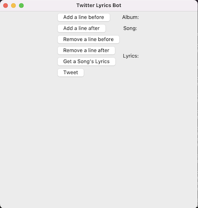

# Project_LyricsBot

<!-- Summary of Project -->
## Summary
This program is an approach to gain experience in API I/O by scraping information from the web to post on Twitter via 
the Twitter API.

This project is an exersise in the following fields of computer science:
* API Usage
* Web Scraping
* GUI Development 

---
<!-- Description -->
## Description
### Twitter API

### Web Scraper
* This project utilizes the Selenium library, which is able to easily extract text and data from the internet.
* The song lyrics are extracted from genius.com, a popular song lyrics website.
	* A list of songs titles within an artist's dicography serves as a pool to randomly choose from to form the URL 
* Primary output is a filtered array of strings, which represent the lyrical lines of a song.

### GUI Development
* A base class (lyric.py) is created to represent the backend data class of the application.
* The app displays a smaple of lyrics from a randomly chosen song.
	* Samples are typically about three lines long.
	* The application can add/remove lines before/after the sample, to make the sample more coherent.

* Front-end of the application (user-friendly and not completely automated)



<!-- Task List -->
## Task List
* [X] save the lyric data used to a json file 
* [ ] attach more than one artist to the project
* [ ] use the lyric data to automate the program such that only unique lyrics are displayed
* [ ] optimize the scraper such an output is produced faster
* [ ] perfect the text-filtering mechanism to not produce messy lyrical outputs
* [ ] once a user is no longer needed, design a cron job script for lyrics to automatically be posted after a specified 
interval
---

<!-- Link to Account -->
Feel free to follow the accounts listed below :)
[Alex G Twitter Bot Account](https://twitter.com/houseofsugarbot)

<!-- Build Specifications -->
If you are interested in creating a similar project, the 'requirements.txt' folder contains the necessary libraries used 
to complete this project. This project can be built using a conda virtual environment. Run this command to install the required Python libraries listed in the 
file 'requirements.txt'.

```bash
conda create --name <env_name> --file requirements.txt
```

---
